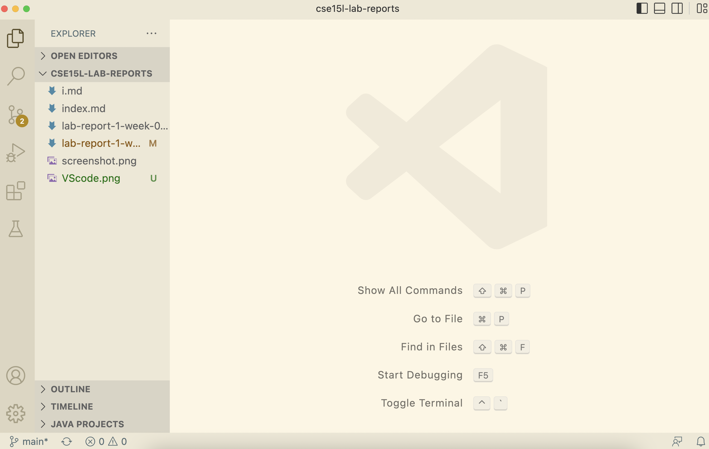
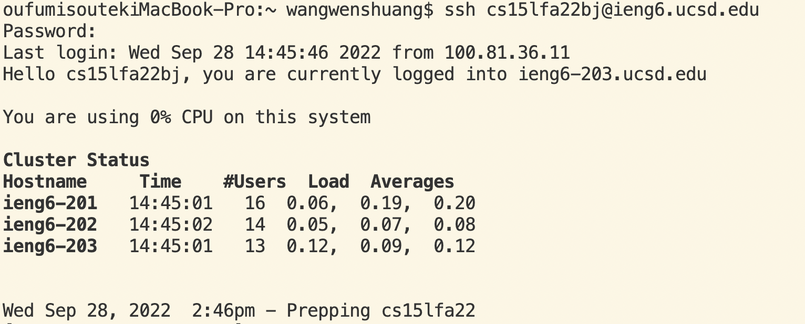
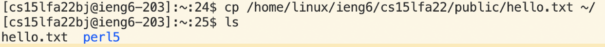
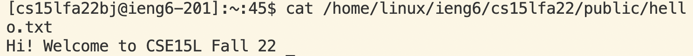
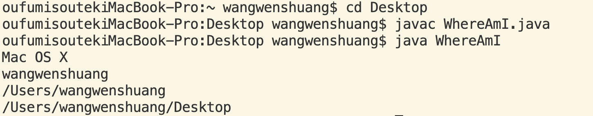
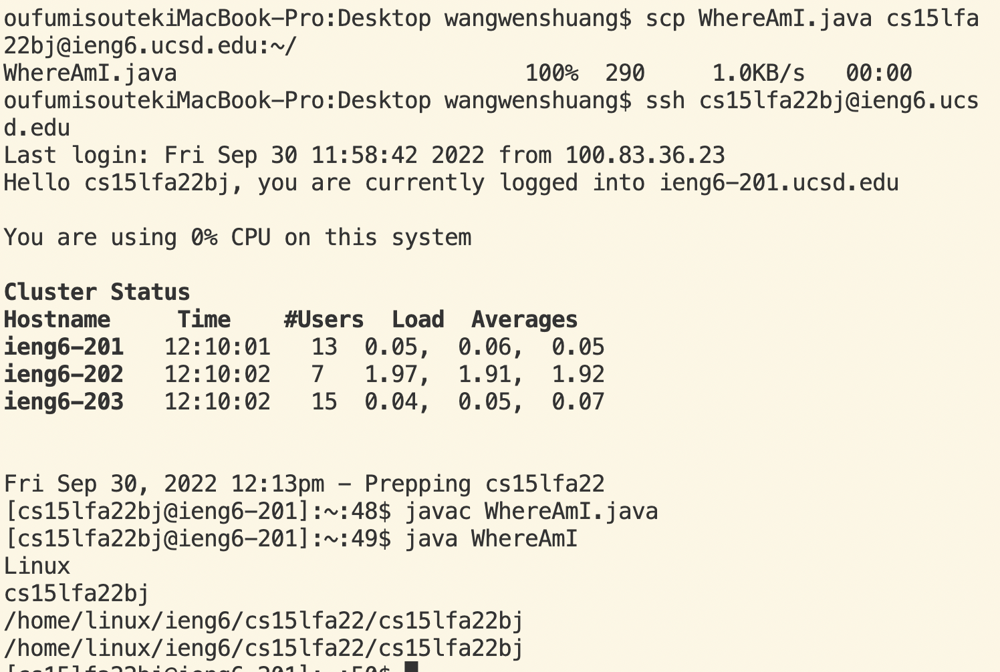
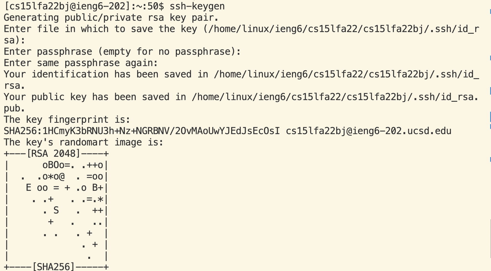
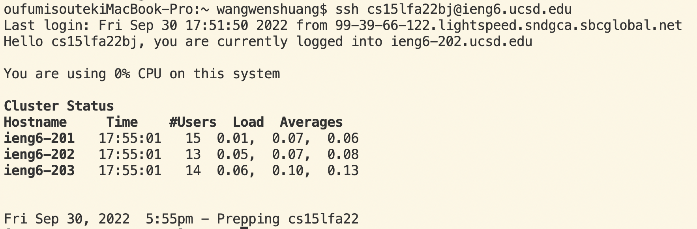
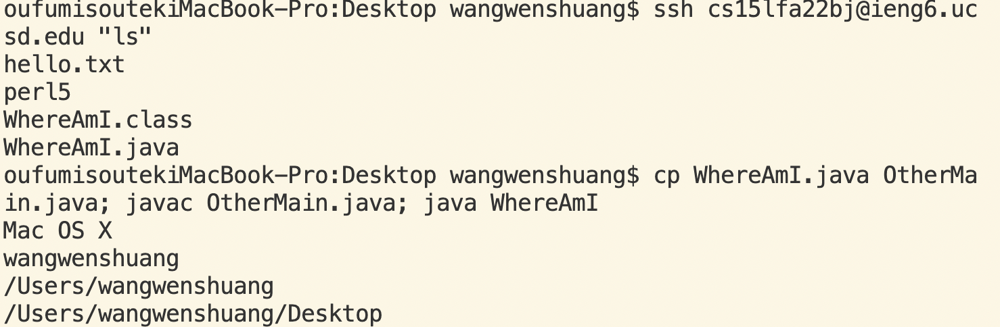

# Lab report1

- **Part 1 - Installing VScode**
1. Go [Link](https://code.visualstudio.com/), follow instructions to install VScode. 
2. After it is installed, I'm able to open a window that looks like this(below, could ignore left side)
>

- **Part 2 - Remotely Connecting**
1. Find my course-specific account through this [Link](https://sdacs.ucsd.edu/~icc/index.php)
2. Open a terminal in VSCode, relace zz with bj that my own course-specific account. Command below line in ternimal.  
> $ ssh cs15lfa22bj@ieng6.ucsd.edu  
3. Enter password to connect the server ( [help with the reset password](https://docs.google.com/document/d/1hs7CyQeh-MdUfM9uv99i8tqfneos6Y8bDU0uhn1wqho/edit)), then get this photo 
>

- **Part 3 - Trying Some Commands**
1. cp - copy hello.txt form /home/linux/ieng6/cs15lfa22/public/ to my home directory
>
2. cat - print the contents of hello.txt
>
- **Part 4 - Moving Files with scp**
1. Create the WhereAmI.java on my desktop, open it in the VScode, run the WhereAmI program using the javac and java commands.
> 
2. Run command below copy WhereAmI.jave to my home directory of ieng6, then run the WhereAmI program using the javac and java commands in the server 
>$ scp WhereAmI.java cs15lfa22bj@ieng6.ucsd.edu:~/
> 
- **Part 5 - Setting an SSH Key**
1. Generating public/private rsa key pair by run ssh-keygen
> 
2. Since I've done this part during lab, I try to run the command(ssh cs15lfa22bj@ieng6.ucsd.edu), no need to enter the password. What I did is to run command mkdir .ssh on server then command exit. Back on client run command $ scp /Users/joe/.ssh/id_rsa.pub cs15lfa22bj@ieng6.ucsd.edu:~/.ssh/id_rsa.pub. Then I'm able to from this client to the server without entering your password.
> 
- **Part 6 - Optimizing Remote Running**
1. Make a local edit to WhereAmI.java. Sice we copy this java file to my home directory previously, then we log in and see the list of the home directory on the remote server
2. Copy it to the remote server and run it.
> 