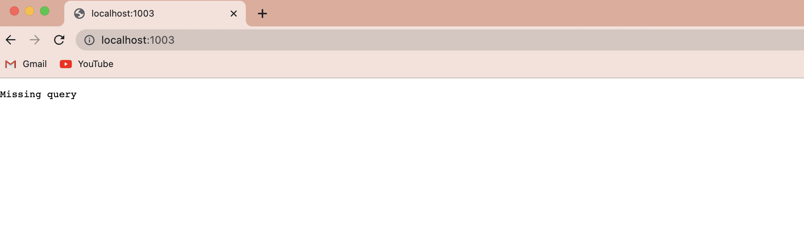
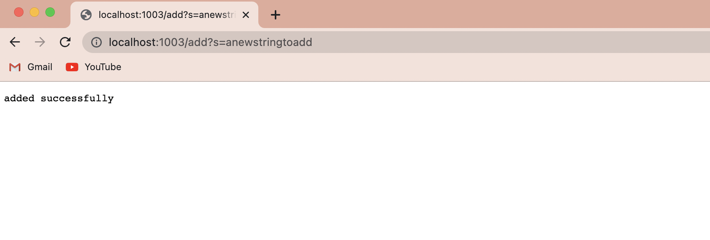
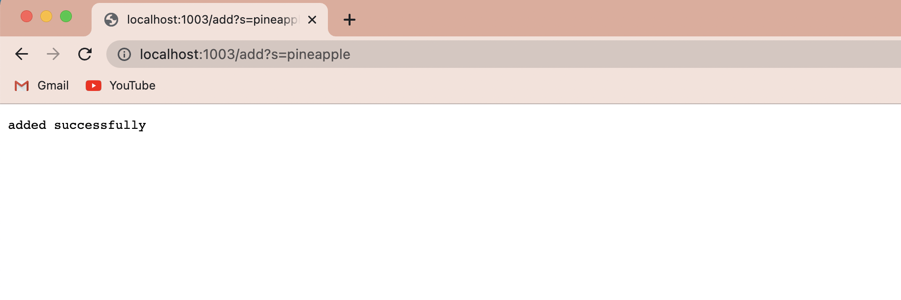
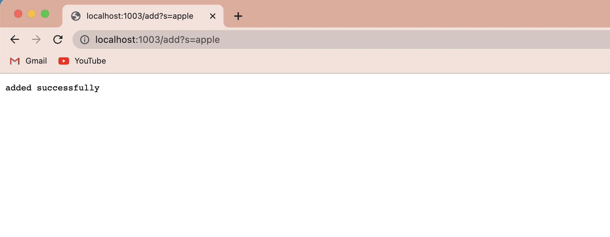
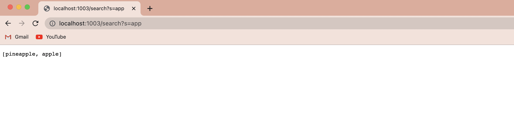
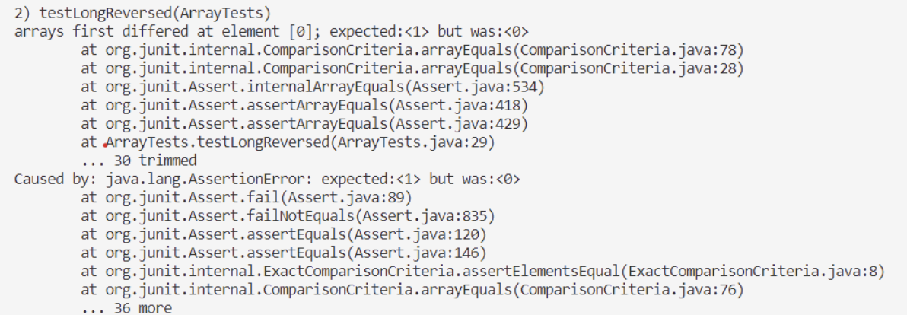
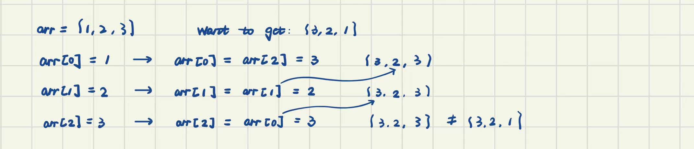
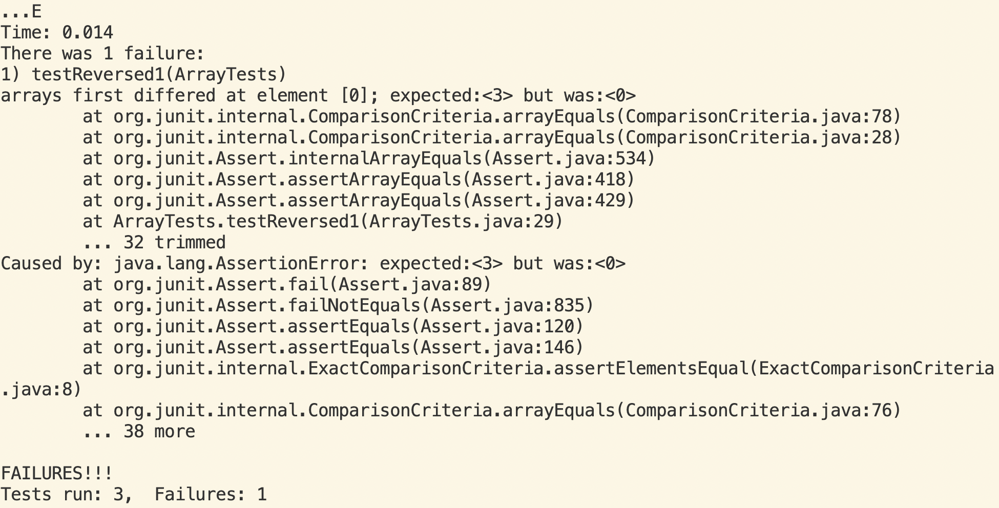

# Lab report2

**Part 1**
#### 
```
class Handler implements URLHandler {
    // The one bit of state on the server: a number that will be manipulated by
    // various requests.
    ArrayList<String> query = new ArrayList<String>();
    public String handleRequest(URI url) {
        if (url.getPath().equals("/")) {
            return String.format("Missing query");
        } 
        
        else if(url.getPath().contains("/add")){
            System.out.println("Path: " + url.getPath());
            if (url.getPath().contains("/add")) {
                String[] parameters = url.getQuery().split("=");
                query.add(parameters[1]);
                return ("added successfully");
            }
            
        }
        else if (url.getPath().contains("/search")){
            String[] parameters = url.getQuery().split("=");
            ArrayList<String> query1 = new ArrayList<String>();
            for(String i: query){
                // System.out.println(i);
                // boolean found = query.stream().anyMatch(s -> s.contains(parameters[1]));
                if(i.contains(parameters[1])){
                    // System.out.println(i);
                    query1.add(i);
                    //return String.format(i);
                }
            }
            // query1.toString();
            return query1.toString();
        }
        return "404 Not Found!";
    }
}
```
> 
Method called: handleRequest
- Values of relevant argument is url: http://localhost:1003
- Values of relevant fields of the class: query is empty []
- Values change or not: no
> 
- Values of relevant argument is url: http://localhost:1003/add?s=anewstringtoadd
- Values of relevant fields of the class: query is [anewstringtoadd]
- Values change or not: change becasue we add one element to the array list query by enterting 'add?s=anewstringtoadd', query.add(parameters[1]) starts to work, add the 'anewstringtoadd' to the query, returns 'added successfully'.
> 
- Values of relevant argument is url: http://localhost:1003/add?s=pineapple
- Values of relevant fields of the class: query is [anewstringtoadd, pineapple]
- Values change or not: change becasue we add one element to the array list query by enterting 'add?s=pineapple', query.add(parameters[1]) starts to work, add the 'pineapple' to the query, returns 'added successfully'.
> 
- Values of relevant argument is url: http://localhost:1003/add?s=apple
- Values of relevant fields of the class: query is [anewstringtoadd, pineapple, apple]
- Values change or not: change becasue we add one element to the array list query by enterting 'add?s=apple', query.add(parameters[1]) starts to work, add the 'apple' to the query, returns 'added successfully'.
> 
- Values of relevant argument is url: http://localhost:1003/search?s=app
- Values of relevant fields of the class: query is [anewstringtoadd, pineapple]
- Values change or not: not change after entering 'search?s=app' because we never change the query, we create the new array list called query1 to add these substring which contains 'app'.

**Part 2**
### Array Methods

1st symptom: 
failure-inducing input :{1,2,3}
```
@Test
  public void testReverseInPlace1() {
    int[] input1 = { 3,2,1 };
    ArrayExamples.reverseInPlace(input1);
    assertArrayEquals(new int[]{ 1,2,3 }, input1);
	}
```
> 

The bug:
we didn't let a new arry to save the value which casue we can get {3,1,3} instead of {3,2,1}

The fix:
```
for(int i = 0; i < newArray.length; i += 1) {
      
      arr[i] = newArray[arr.length - i - 1];
    }
```
Why does the bug cause that particular symptom:
> 


2nd symptom:
failure-inducing input :{1,2,3}
```
@Test
  public void testReversed1() {
    int[] input1 = {1,2,3};
    assertArrayEquals(new int[]{3,2,1}, ArrayExamples.reversed(input1));
  }
```
> 

The bug:
We didn't save the array to the new array and also not reutrn the new array.

The fix:
```
static int[] reversed(int[] arr) {
    int[] newArray = new int[arr.length];
    for(int i = 0; i < arr.length; i += 1) {
      newArray[i] = arr[arr.length - i - 1];
    }
    return newArray;
  }
```

