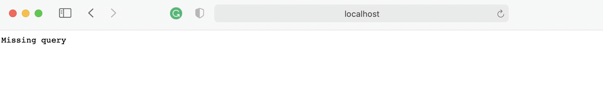
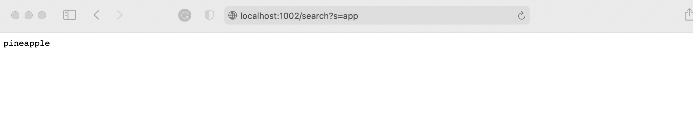

# Lab report2

**Part 1**
#### 
```
ArrayList<String> query = new ArrayList<String>();
    public String handleRequest(URI url) {
        if (url.getPath().equals("/")) {
            return String.format("Missing query");
        } 
        
        else if(url.getPath().contains("/add")){
            System.out.println("Path: " + url.getPath());
            if (url.getPath().contains("/add")) {
                String[] parameters = url.getQuery().split("=");
                query.add(parameters[1]);
                return ("");
            }
        }
        else if (url.getPath().contains("/search")){
            String[] parameters = url.getQuery().split("=");
            for(String i: query){
                // System.out.println(i);
                // boolean found = query.stream().anyMatch(s -> s.contains(parameters[1]));
                if(i.contains(parameters[1])){
                    // System.out.println(i);
                    return String.format(i);
                }
            }
        }
        return "404 Not Found!";
    }
```
> 
> 

**Part 2**
### Array Methods

1st symptom: 
failure-inducing input :{1,2,3}
```
@Test
  public void testReverseInPlace1() {
    int[] input1 = { 3,2,1 };
    ArrayExamples.reverseInPlace(input1);
    assertArrayEquals(new int[]{ 1,2,3 }, input1);
	}
```
> 

The bug:
we didn't let a new arry to save the value which casue we can get {3,1,3} instead of {3,2,1}

The fix:
```
for(int i = 0; i < newArray.length; i += 1) {
      
      arr[i] = newArray[arr.length - i - 1];
    }
```
Why does the bug cause that particular symptom:
> 


2nd symptom:
failure-inducing input :{1,2,3}
```
@Test
  public void testReversed1() {
    int[] input1 = {1,2,3};
    assertArrayEquals(new int[]{3,2,1}, ArrayExamples.reversed(input1));
  }
```
> 

The bug:
We didn't save the array to the new array and also not reutrn the new array.

The fix:
```
static int[] reversed(int[] arr) {
    int[] newArray = new int[arr.length];
    for(int i = 0; i < arr.length; i += 1) {
      newArray[i] = arr[arr.length - i - 1];
    }
    return newArray;
  }
```

