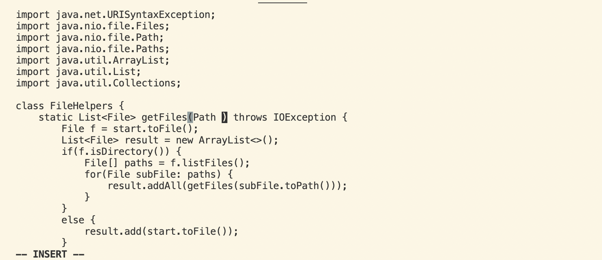
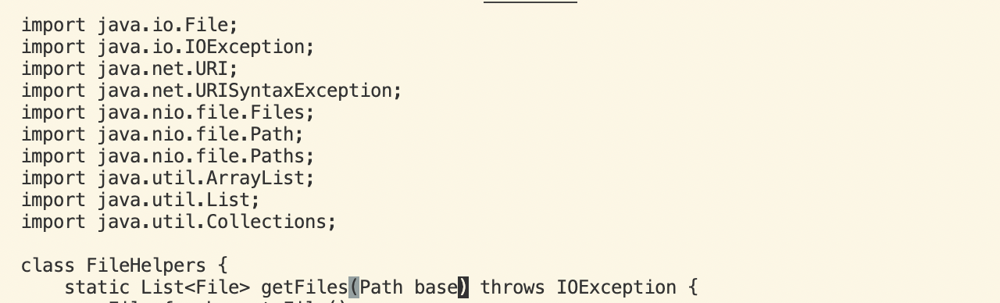
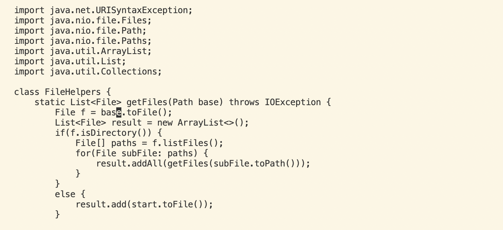
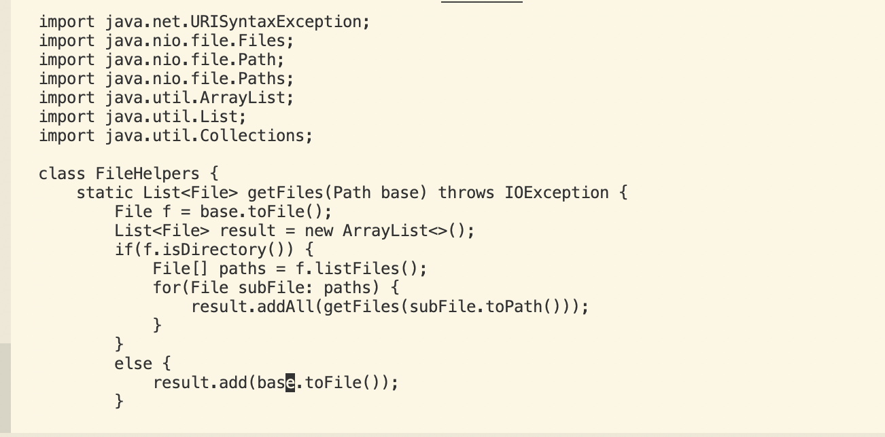

# Lab report4

**Part1**

- Demo: Changing the name of the start parameter and its uses to base

step 1:
- vim D`<tab>`, then press `<enter>`. 
- Goal: To enter the file then we're in the normal mode, the cursor position starts at the first character of the blew code.


```
import java.io.File;
import java.io.IOException;
import java.net.URI;
import java.net.URISyntaxException;
import java.nio.file.Files;
import java.nio.file.Path;
import java.nio.file.Paths;
import java.util.ArrayList;
import java.util.List;
import java.util.Collections;

class FileHelpers {
    static List<File> getFiles(Path base) throws IOException {
        File f = base.toFile();
        List<File> result = new ArrayList<>();
        if(f.isDirectory()) {
            File[] paths = f.listFiles();
            for(File subFile: paths) { 
                result.addAll(getFiles(subFile.toPath()));
            }
        }
        else {
```

step 2:
- /start then `<enter>`.
- Goal: To search the word that we want to change, syntax is / + searchword, the cursor postition is the first character of the searchword
> 

step 3:
- ce
- Goal: deletes word 'start' and return insert mode
> 

step 4:
- 'base' then '<esc>'
- Goal: replaces to new word 'base'
> 

step 5:
- n.
- Goal: repeats the last search from the cursor's position down
> 

step 6:
- n.
- Goal: repeats the last search from the cursor's position down
> 

step 7:
- :wq then press `<enter>`
- Goal: save and quit
> 
> 

step:  $ vim D `<tab>` `<enter>` -> `/start`-> `<Enter>` -> ce  -> base -> `<Escape>` -> `n.`->`n.` -> `:wq` -> `<Enter>`
total: 12 keys pressed

**Part2**
- The second one took me 3-5 mins, the first one took me longer than the second one, because we worked on the remote, so every change to the file will not save to the remote, we have to <kbd>scp</kbd> again to the remote, then can access the modified file.

- I prefer the second one if I run remotely, because I don't have to scp my file to remote after editing it. Vim can directly change the file on the remote.

- If I work on the local, I will not use vim to edit my file on the terminal. I don't have to consider how to save my file after editing on the local, becasue it's auto save.