# Lab report4

**Part1**

- Demo: Changing the name of the start parameter and its uses to base

step 1:
- vim DocSearchServer.java, then press enter. 
- Goal: To enter the file then we're in the normal mode.

> 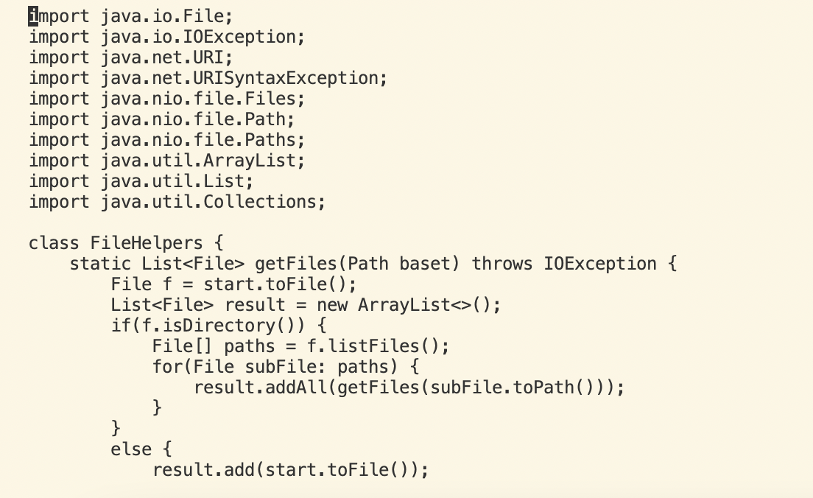

step 2:
- /start, then press enter.
- Goal: To search the word that we want to change, syntax is / + searchword, the cursor postition is the first character of the searchword
> 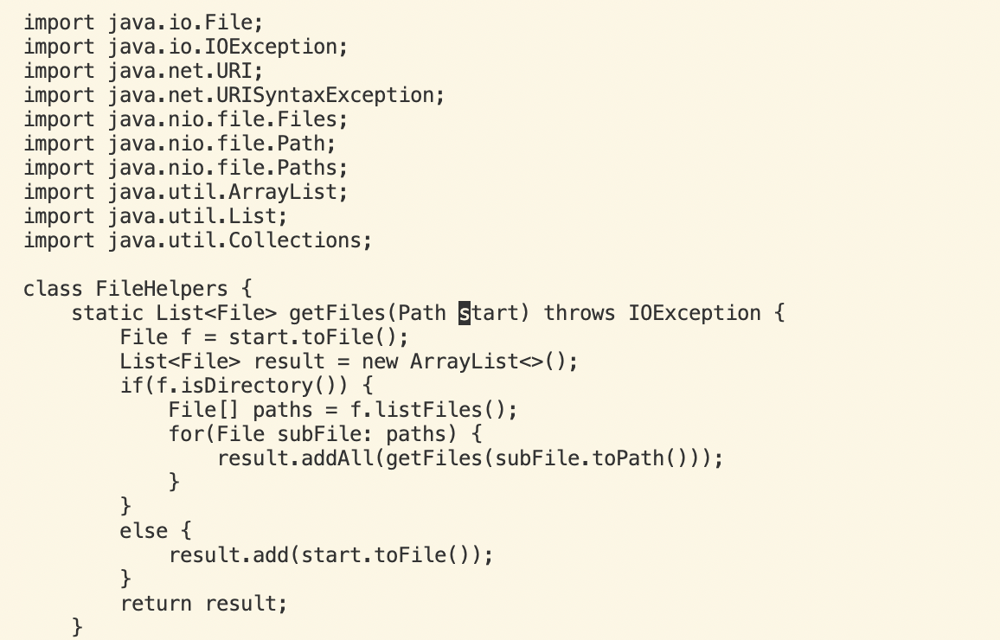

step 3:
- dw
- Goal: delete the characters of the word from the cursor position to the start of the next word
> 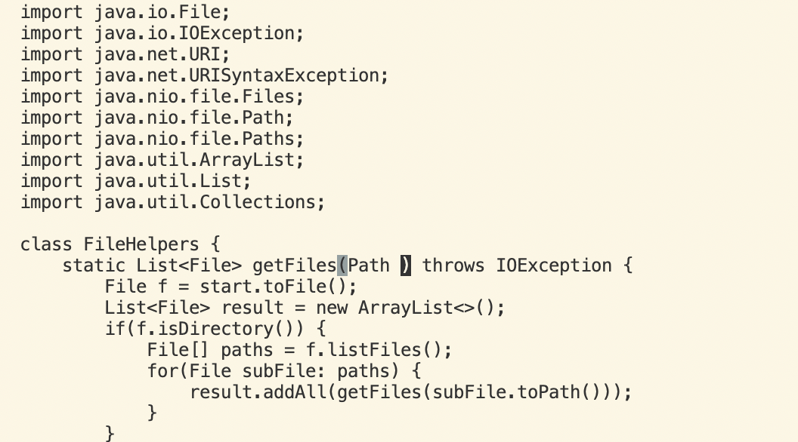

step 4:
- i then tap base,  then press esc
- Goal: go to the insert mode add new word 'base' after the 'Path', then leave insert mode to normal mode
> 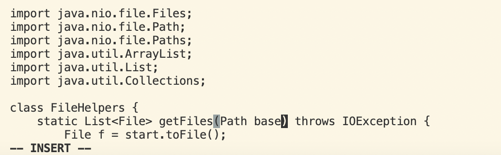

step 5:
- n
- Goal: repeats the last search from the cursor's position down
> 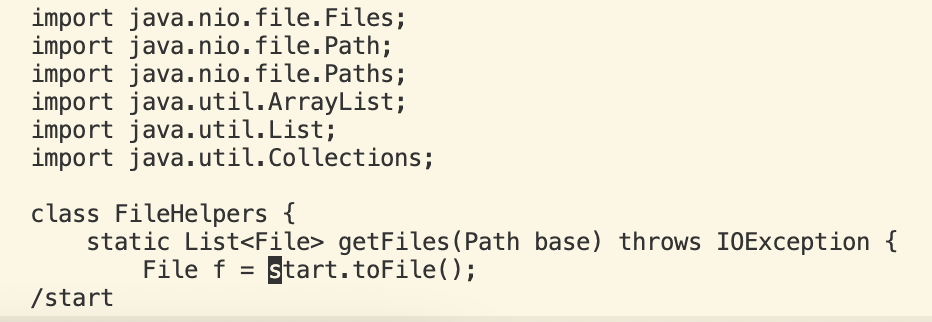

step 6:
- dw
- Goal: delete the characters of the word from the cursor position to the start of the next word
> 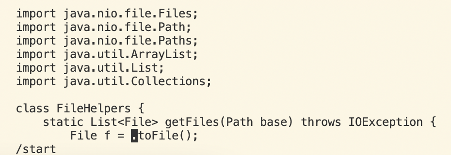

step 7:
- i then tap base,  then press esc
- Goal: go to the insert mode add new word 'base' after the '= ', then leave insert mode to normal mode
> 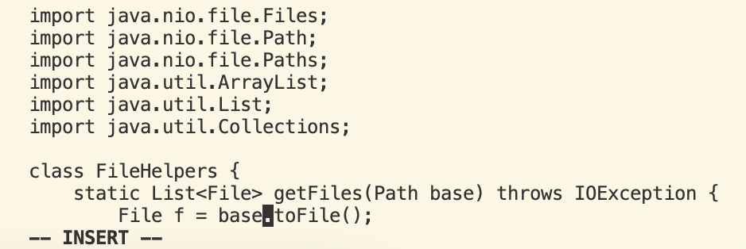

step 8:
- n
- Goal: repeats the last search from the cursor's position down
> 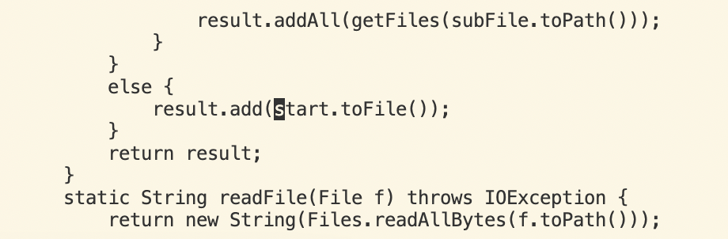

step 9:
- dw
- Goal: delete the characters of the word from the cursor position to the start of the next word
> 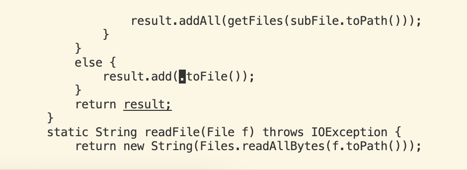

step 10:
- i then tap base,  then press esc
- Goal: go to the insert mode add new word 'base' after the '(', then leave insert mode to normal mode
> 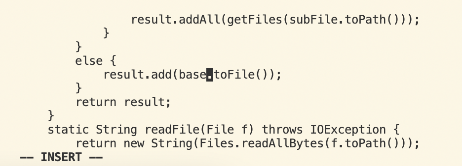

step 11:
- :wq
- Goal: save and quit
> 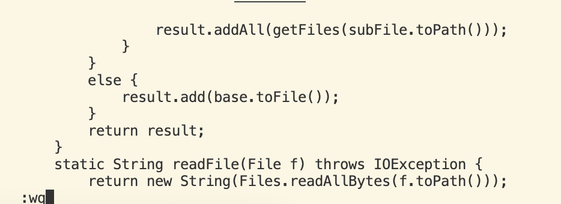
> 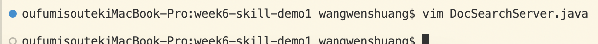

step:  vim DocSearchServer.java -> /start -> dw -> i -> base -> esc -> n -> dw -> i -> base -> esc -> n -> dw -> i -> base -> esc -> :wq -> enter

**Part2**