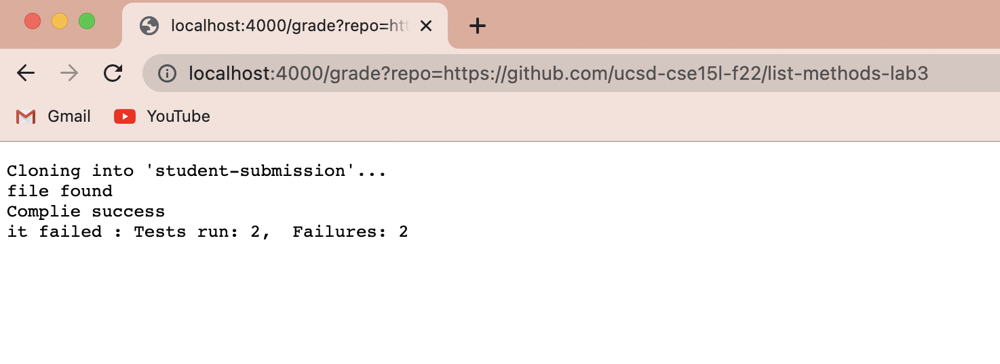
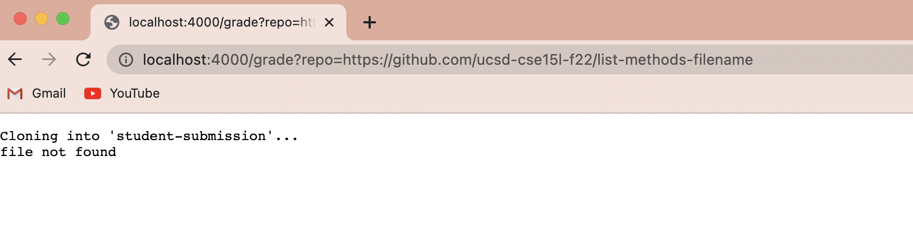
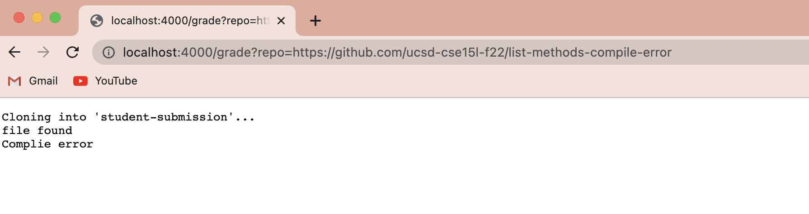
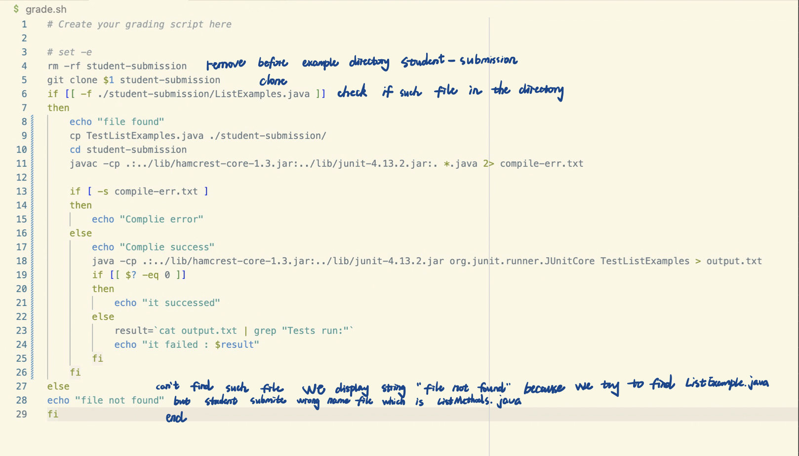

# Lab report5

**Part1**
#### 
```
# Create your grading script here

# set -e
rm -rf student-submission
git clone $1 student-submission
if [[ -f ./student-submission/ListExamples.java ]]
then
    echo "file found"
    cp TestListExamples.java ./student-submission/
    cd student-submission
    javac -cp .:../lib/hamcrest-core-1.3.jar:../lib/junit-4.13.2.jar:. *.java 2> compile-err.txt
    
    if [ -s compile-err.txt ]
    then 
        echo "Complie error"
    else
        echo "Complie success"
        java -cp .:../lib/hamcrest-core-1.3.jar:../lib/junit-4.13.2.jar org.junit.runner.JUnitCore TestListExamples > output.txt
        if [[ $? -eq 0 ]]
        then
            echo "it successed"
        else
            result=`cat output.txt | grep "Tests run:"`
            echo "it failed : $result"
        fi
    fi
else
echo "file not found"
fi
```
example1:
> 
example2:
> 
example3:
> 

**Part2**
###
Trace:
example2
> 
